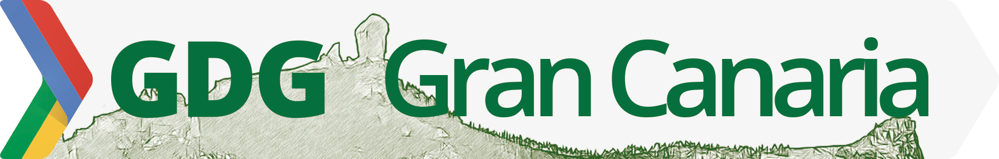

### Principios
  - Humildad
  - Respeto
  - Comunicación

### Aptitudes
  - Pasión
  - Ganas de aprender
  - Ganas de compartir

### Manifiesto

 **Humildad, respeto y cercanía** frente al elitismo y la arrogancia.
 
 **Colaboración y participación** sobre la competición.
 
 **Compartir conocimiento por parte de muchos** frente a la adquisición y reserva de muchos conocimientos por unos pocos
 
 Esto es, no apreciamos los elementos de la derecha, y por eso buscamos su reemplazo con los de la izquierda. 
 
---
 

Google developers group Gran Canaria es un espacio para debatir y hablar sobre tecnologías, lenguajes, frameworks, diseño, experiencia de usuario, procesos y todo lo que tenga que ver con el ecosistema de las tecnologías de la información. Somos profesionales apasionados con muchas ganas de aprender así como compartir lo que sabemos, siempre con humildad y respeto.

Nuestra comunidad brinda una experiencia libre de acoso, maltrato y/o violencia para todos sus miembros sin importar el sexo, orientación sexual, edad, discapacidad, apariencia física, tamaño, peso, raza, etnia, religión o falta de ella y cualquier elección tecnológica. No toleramos ningún tipo de acoso, maltrato o violencia con ningún miembro ni de ninguna manera. El no cumplimiento de esta norma podría provocar la expulsión de la misma.

###### Disclaimer
El GDG Gran Canaria es un grupo independiente; las actividades y opiniones expresadas en esta comunidad no deben de asociarse de ninguna manera con Google la corporación.
